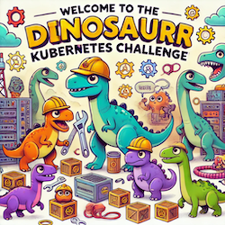
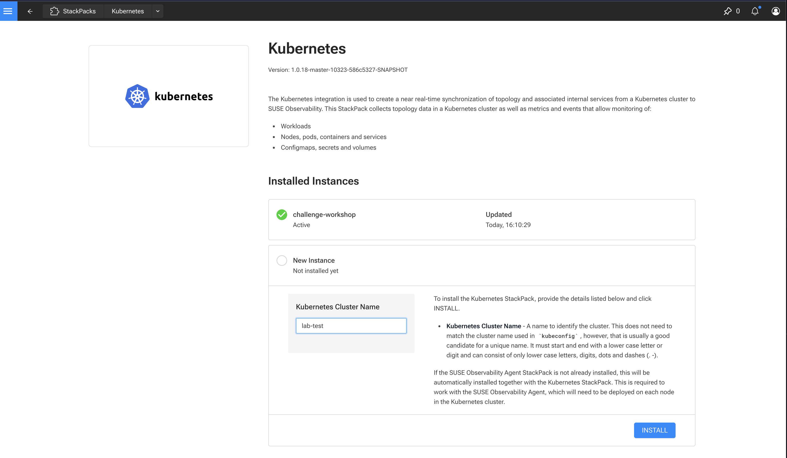
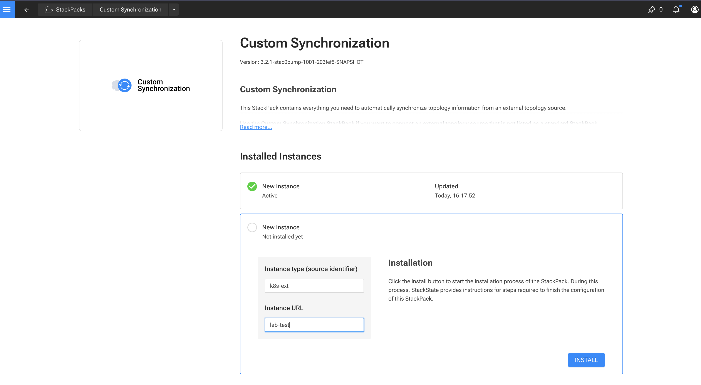

# Suse Observability Challenges

This repository contain various kubernetes challenges that showcase's Suse Observaility and its troubleshooting capabilities.



## Dino Adventures that await

- [Broken Brontosaurus](./labs/broken-brontosaurus/assignment.md)
    - Troubleshoot crashback loop
- [Forgetasaurus](./labs/forgetasaurus/assignment.md)
    - Troubleshoot memory issues
- [Dino Diner](./labs/dino-diner/assignment.md)
    - Troubleshoot slow responses using traces
- [Jurassic Net](./labs/jurassic-net/assignment.md)
    - Troubleshoot slow responses and 5xx http errors without traces
- [Stegostorage](./labs/stegostorage/assignment.md)
    - Troubleshoot pending state
- [Configosaurus](./labs/configosaurus/assignment.md)
    - Troubleshoot application behaviour in relation to config
- [Dino Kiosk](./labs/dino-kiosk/assignment.md)
    - Troubleshoot traces error rate

## Prerequisites

- [Taskfile](https://taskfile.dev/installation/)
    - `task` cli supports tab completion which is handy to see available tasks.
- [Gomplate](https://docs.gomplate.ca/installing/)
- [Helm](https://helm.sh/docs/intro/install/)
- [Lima](https://lima-vm.io/docs/installation/)

You will also need access to a Suse Observability instance.


## Environment 

Create a `.env` file 

```bash
cp .env.example .env
```

Change the content with details about your environment.

```bash
CLUSTER_NAME=lab-test  # Suse Observability Kubernetes StackPack instance name
STS_URL=https://xxx-lab.app.stackstate.io
STS_API_KEY=tmnpPT69Z
OTEL_ENDPOINT=otel-xxx-lab.app.stackstate.io:443
```

## Local Cluster

You can test or try out challenges on a local k3s instance using Lima. 
Use the predefined tasks to manage the vm

```bash
# create the vm
task local:create-vm

# stop the vm
task local:stop-vm

# start the vm
task local:start-vm

# setup local kubectx 
eval $(task local:shell-env)
kubectl get nodes

# destroy the vm
task local:destroy-vm

```

### Remote Cluster

If you have a remote kubernetes cluster, you need to setup a download the kubeconfig.  Then setup your `.env` similar to,

```bash
LOCAL_CLUSTER=false
CLUSTER_NAME=lab-test
# When LOCAL_CLUSTER is false, specify the kubeconfig to use:
KUBECONFIG_FILE_PATH=~/sts/repos/github/ravan/observability-hands-on
KUBECONFIG_FILE_NAME=kubeconfig
```


## Deploy Suse Observability Agents

Before deploying the agents, make sure you have setup stackpack instances on the Suse Observability server for kubernetes and the custom sync.

### Stackpack Instances

#### Kubernetes



#### Kubernetes Extension



### Deploy Agents

```bash

# Install Suse Observability Agent
task local:deploy-observability-agent

# Install Open Telemetry Agent
task local:deploy-otel-agent

# Install the Suse Observability Agent extensions 
task local:deploy-observability-agent-extensions
```

## Running a challenge

Challenges are run using predefined task for the challenge that have the pattern,

```bash
# Read the challenge instructions
task labs:< name of challenge>:assignment

# The inststructions will generally lead to 3 setups you need to perform in environment

# 1) Setup the challenge.
task labs:<name of challenge>:setup 

# 1.1) Sometimes there will be a trigger 
task labs:<name of challenge>:trigger

# 2) Resolve the challenge
task labs:<name of challenge>:resolve

# 3) Tear down the challenge
task labs:<name of challenge>:teardown

```

## Pre-staging Scenarios

When doing an interactive workshop with a large group in a short amount of time, it may not be practical to do the challenges
in an online learning platform where each individual has their own environment.

Instead, we could create a single login account in Suse Observability for all participants and use time travel for candidates 
to explore error and healthy states of the challenges.

The challenges can be pre-staged with healthy and error states with predictable timings.

```bash
# Will delete all namespaces that were used by previous labs
scenario:clean

# Typical flow
scenario:setup-<lab>
scenario:resolve-<lab> .   #optional
scenario:teardown-<lab>


```

### Brotosaurus Lab Scenario

```bash
scenario:setup-brontosaurus
scenario:trigger-brontosaurus
scenario:teardown-brontosaurus
```

### Dino Diner Lab Scenario

```bash
scenario:setup-dino-diner
scenario:resolve-dino-diner
scenario:teardown-dino-diner
```

### Forgetasaurus  Lab Scenario

```bash
scenario:setup-forgetasaurus
scenario:resolve-forgetasaurus
scenario:teardown-forgetasaurus
```
### Stegosaurus Lab Scenario

```bash
scenario:setup-stegosaurus
scenario:resolve-stegosaurus
scenario:teardown-stegosaurus
```
### Jurassic Net Lab Scenario

```bash
scenario:setup-jurassic-net
scenario:resolve-jurassic-net
scenario:teardown-jurassic-net
```

### Configosaurus  Lab Scenario

```bash
scenario:setup-configosaurus
scenario:resolve-configosaurus
scenario:teardown-configosaurus
```

> [!WARNING]
> Some assignments are written to primarily use Rancher Manager and Suse Observability from a learning platform. For testing however, we can
> use the Helm Charts directly instead of doing it through Rancher. 
