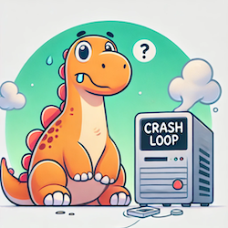

Challenge Setup
================

Install the challenge,

```bash
task labs:brontosaurus:setup
```


Broken Brontosaurus
====================



Meanwhile while you were busy setting up SUSE Observability, our Brontosaurus was re-deployed to the downstream cluster, but it seems to be broken. Can you help us fix it?

Finding the Brontosaurus
========================

The Brontosaurus is running in the `museum` namespace in the downstream cluster. Go to the [button label="SUSE Observability" style="primary"](tab-3), and then follow these steps:

1. Expand the hamburger menu in the top left corner and click on `Pods`.
2. In the top-right corner, filter to your cluster (`[[ Instruqt-Var key="DOWNSTREAM_CLUSTER_NAME" hostname="management" ]]`) and the `museum` namespace.
3. Click on the `brontosaurus` pod to see its details.

First steps in troubleshooting
==============================

I hope you managed to find the Brontosaurus pod. As you can see it is in an unhealthy state. Let's see whether we can find out what's wrong with it.

If we look at the Monitors section, we can see all the out of the box monitors that are available for the Brontosaurus pod. These monitors are pre-installed with the SUSE Observability platform and can help us troubleshoot issues like these. Let's have a look at the monitors and see if we can find out what's wrong with the Brontosaurus.

The monitor we are interested in is the `Pod Waiting State (CrashLoopBackOff)` monitor. Click on this monitor to see the details of why it's failing. If we scroll down, we find the remediation guide that will help us fix the issue.

> [!TIP]
> The links in the Remediation Guide take you directly to the relevant pages to investigate. When you click these, the Remediation Guide will appear in context on the right side of the screen.

Once you know what to fix, go to Rancher and fix the issue, and wait a moment for SUSE Observability to pick up the changes and verify that the Brontosaurus is now running as expected.

If you need more help, expand the next sections for a step by step guide on how to fix the issue.

Diagnosis
=========

The Brontosaurus pod is in a `CrashLoopBackOff` state. This means that the pod is crashing and restarting continuously. This is usually caused by an issue with the application running inside the pod.

The monitor that is failing is the `Pod Waiting State` monitor. This monitor checks whether a pod is in a `Waiting` state for a prolonged period. If it is, it will alert you so you can investigate the issue. If it detected an initial reason for the pod to be in a `Waiting` state, it will show this in the monitor details, in this case it's a `CrashLoopBackOff` state.

In the Remediation Guide you will be taken first to the "Events" section to check whether there are any events that might give you a clue about what's wrong. In this case the Events only show that the Pod keeps on crashing. The next step is to check the "Logs" of the pod to see if there are any errors that might give you a clue about what's wrong.

If you look at the logs, you see the Brontosaurus complaining about the year being wrong. This is a common issue with the Brontosaurus, it's very sensitive to the year it's running in. Can you fix this issue?

Fixing the issue using Rancher
==============================

Go to the [button label="Rancher" style="primary"](tab-2) and go to the `Workloads > Deployments` of the downstream (`[[ Instruqt-Var key="DOWNSTREAM_CLUSTER_NAME" hostname="management" ]]`) cluster. Find the `broken-brontosaurus` deployment and edit the YAML.

In the YAML, find the `YEAR` environment variable and set it to a year (`-70000000`) when the brontosaurus was not yet extinct. Save the changes and wait a moment for the pod to restart. Once the pod is running, go back to SUSE Observability and verify that the Brontosaurus is now running as expected.

Fixing the issue using task
============================

```bash
task labs:brontosaurus:resolve
```

Challenge Teardown
===================

```bash
task labs:brontosaurus:teardown
```
